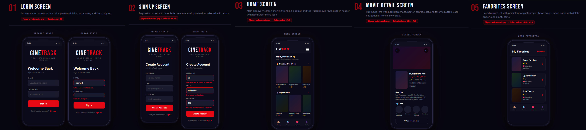
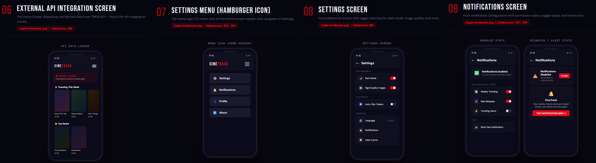

# CineTrack 🎬

A mobile movie tracking app built with **Expo (React Native)** using the TMDB API.

## Features
- 🔐 User Authentication (Signup / Login with AsyncStorage)
- 🏠 Home Screen with Trending, Popular & Top Rated movies
- 🔍 Movie Search
- 🎬 Movie Detail Screen with cast info
- ❤️ Favorites with local persistence (AsyncStorage)
- ⚙️ Settings Screen with preferences
- 🔔 Push Notifications
- 👤 User Profile

## Setup Instructions

### 1. Clone the repository
```bash
git clone https://github.com/YOUR_USERNAME/cinetrack.git
cd cinetrack
```

### 2. Install dependencies
```bash
npm install
```

### 3. Configure TMDB API Key
1. Create a free account at [themoviedb.org](https://www.themoviedb.org)
2. Go to Settings → API → Create API Key
3. Open `app/utils/api.js`
4. Replace `YOUR_TMDB_API_KEY` with your actual key

### 4. Start the app
```bash
npx expo start
```
Scan the QR code with Expo Go (iOS/Android).

## Project Structure
```
app/
├── _layout.js              # Root layout with providers
├── index.js                # Entry redirect
├── (auth)/
│   ├── login.js            # Login screen
│   └── signup.js           # Signup screen
├── (tabs)/
│   ├── home.js             # Home screen (API integration)
│   ├── search.js           # Search screen
│   ├── favorites.js        # Favorites (local storage)
│   └── profile.js          # Profile screen
├── movie/[id].js           # Movie detail screen
├── settings.js             # Settings screen
├── notifications.js        # Notifications screen
├── context/
│   ├── AuthContext.js      # Auth state management
│   └── FavoritesContext.js # Favorites state + persistence
└── utils/
    ├── api.js              # TMDB API calls
    └── notifications.js    # Push notification helpers
```

## Tech Stack
- Expo / React Native
- Expo Router (file-based navigation)
- AsyncStorage (local persistence)
- TMDB API (external API)
- Expo Notifications
- @expo/vector-icons (Ionicons)

## Figma Design Evidence

Figma Evidence 1



Figma Evidence 2

